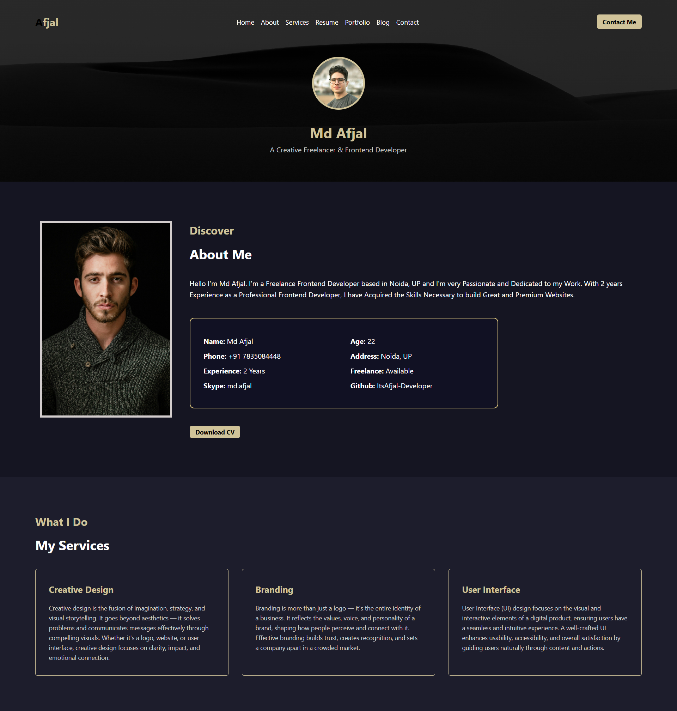

# Incapp - Assignment-9

This is the 9th Assignment Project from INCAPP Institute, Created as part of the Frontend Development Training. The Assignment Demonstrates Practical use of **HTML** and **CSS** to Create a Visually Appealing and Responsive Layout.

## Features

- Fully responsive layout
- Use of modern CSS styling
- Clean and semantic HTML structure
- Beginner-friendly and well-organized code

## Tech Stack

**Client:** HTML5, CSS3  
**Server:** None (Static Site)

## Screenshots

Below is a Preview of **Assignment 9**, Showcasing the Layout and Styling implemented Using pure HTML and CSS. 
The Design focuses on Clean Structure, Responsiveness and Modern Styling.

